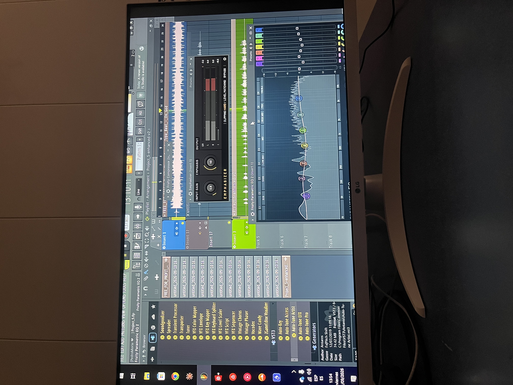
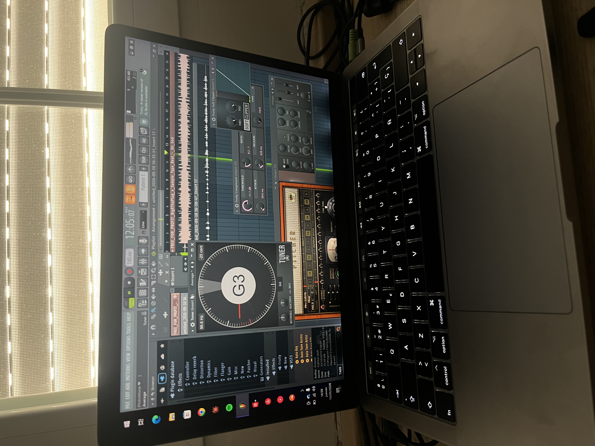
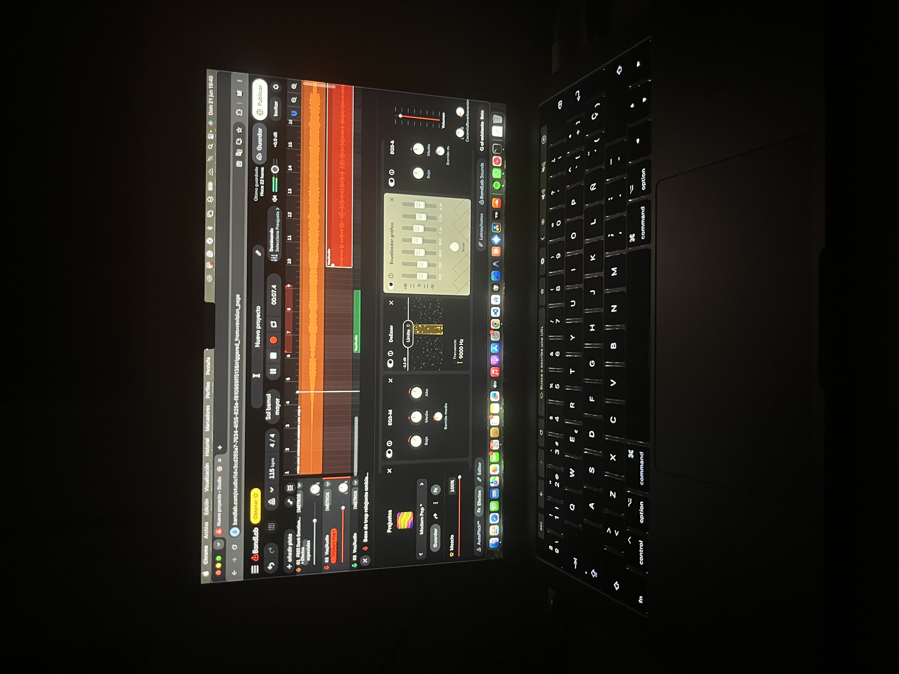
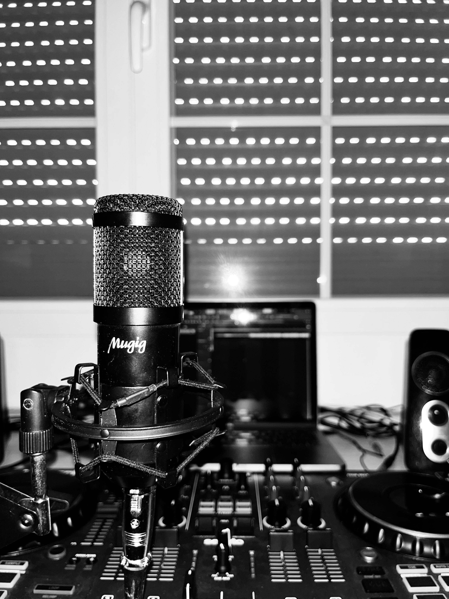
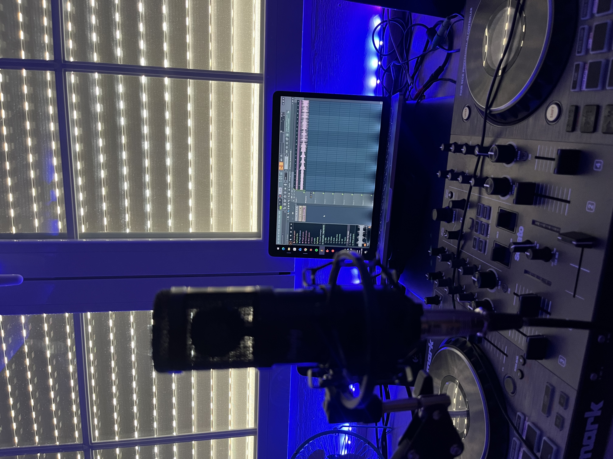

# Proyecto 1: Producción musical

## Introducción

Para mí, la música nunca ha sido solo algo que pongo de fondo o un pasatiempo para cuando tengo tiempo libre. Es el motor de casi todo lo que hago cuando quiero crear: una idea puede empezar con un ritmo, convertirse en una frase y acabar siendo una canción que cuenta algo que tenía dentro. Hacer música me ha enseñado a tener paciencia, a probar sin miedo a equivocarme y a volver sobre una idea hasta que empieza a sonar como la imaginaba.

Este proyecto es el resultado de un camino que llevo construyendo desde hace años. Todavía estoy aprendiendo y sé que me queda muchísimo por mejorar, pero justo eso es lo que me engancha: cada sesión me deja algo nuevo, aunque solo sea descubrir una forma distinta de escribir una barra o de encajar una voz en la base.

## Los inicios: FL Studio Mobile

Todo empezó cuando tenía 12 años y empecé a trastear con FL Studio Mobile desde el móvil. No sabía demasiado de producción, pero me podía pasar un buen rato probando sonidos, colocando ritmos y cambiando cosas hasta encontrar algo que me gustase. Al principio era pura curiosidad: quería ver qué podía crear con las herramientas que tenía a mano.

Mis primeros beats no eran perfectos, ni mucho menos, pero ahí aprendí algo que todavía me acompaña: una idea no tiene que salir terminada a la primera. A veces un ritmo que no funciona te lleva a otro mejor; otras, basta con cambiar un sonido o mover una pieza para que todo encaje. Sin darme cuenta, empecé a escuchar la música de otra manera, fijándome en cómo se construían las bases y en qué hacía que un tema tuviese su propio ambiente.

Con el tiempo, aquella curiosidad fue creciendo y empecé a dedicarle cada vez más atención. Pasé de simplemente probar aplicaciones a guardar ideas, trabajar en proyectos y pensar en cómo podría sonar algo antes incluso de empezar a montarlo.

## El salto a la letra y el freestyle

### De crear bases a contar mis propias historias

Después de hacer bases, el siguiente paso fue empezar a escribir mis propios temas de rap. Si antes intentaba construir el ritmo, ahora también quería encontrar las palabras que pudieran vivir encima de él. Empecé a grabar en BandLab, probando cómo quedaban mis letras con una instrumental y aprendiendo poco a poco a soltar la voz delante del micro.

Grabarme me ayudó a escucharme desde fuera. Una frase que sobre el papel parecía buena podía sonar forzada al decirla; otras veces, una toma espontánea tenía más verdad que algo que había repasado mil veces. Con cada intento fui entendiendo mejor el ritmo, las pausas y la intención que quiero darle a lo que escribo.

### El freestyle como campo de entrenamiento

El freestyle con mi primo y mis amigos ha sido otra parte clave del proceso. Para mí, esas sesiones son como un campo de entrenamiento: me obligan a escuchar, reaccionar y buscar una idea en el momento, sin tener tiempo para juzgar cada palabra antes de decirla.

También me han ayudado a perder la vergüenza. Improvisar delante de gente cercana hace que poco a poco te sueltes, aceptes que no todo va a salir redondo y aprendas a seguir aunque una rima no funcione. Además de ser un buen rato, es una forma de mantener la mente ágil y encontrar giros o combinaciones que luego puedo desarrollar escribiendo.

## Influencias y entorno

He tenido la suerte de contar con dos amigos muy cercanos que también hacen música a un nivel semiprofesional. Tenerlos cerca me ha servido como una escuela y una referencia: puedo ver cómo se toman en serio su trabajo, cómo desarrollan sus ideas y cómo resuelven problemas que yo también me encuentro cuando escribo o grabo.

Compartir ese entorno me anima a mejorar, pero no quiero limitarme a repetir lo que hacen los demás. Estoy intentando encontrar mi propia forma de escribir y de sonar. Para eso me fijo mucho en el ingenio y la crudeza del hip-hop underground. Las letras de Natos y Waor, Jaloner, Sharif y Ardo440 son referencias que me ayudan a pensar en cómo construir mejores barras, cuidar las imágenes y expresar algo con personalidad.

No se trata de copiar un estilo, sino de aprender de lo que me llega: cómo una frase puede ser directa y, a la vez, dejarte pensando; cómo se puede contar algo personal sin maquillarlo demasiado; o cómo una palabra bien colocada puede cambiar el peso de toda una línea. Después intento llevar esas ideas a mi propio terreno.

## Disciplina actual: el trabajo en la sombra

Ahora mismo, gran parte de mi proyecto ocurre lejos de publicar canciones. A día de hoy todavía no he sacado ni un solo tema de manera oficial, pero eso no significa que no esté trabajando. En mi archivo tengo más de 500 letras escritas: ideas completas, versos sueltos, borradores y frases que quizá algún día encuentre su sitio.

Escribo a diario. No todos los días sale una letra que quiera guardar para siempre, pero sentarme a escribir me ayuda a coger ritmo y a no depender únicamente de la inspiración. También vuelvo a mis textos, corrijo, cambio palabras y guardo ideas para retomarlas más adelante. Muchas veces el trabajo importante es precisamente ese: insistir hasta que una letra se parece más a lo que quiero decir.

Además, me grabo en el estudio un mínimo de dos veces por semana. Cada sesión es una oportunidad para probar interpretaciones, revisar cómo suenan las tomas y aprender algo más sobre mi voz. A veces salgo con algo que me convence y otras con una lista de cosas que quiero mejorar; las dos situaciones forman parte del proceso.

Aunque todavía no haya publicado oficialmente, siento que estoy construyendo una base sólida: escribiendo, probando y aprendiendo con constancia. Para mí, este proyecto no va solo de llegar a tener canciones fuera, sino de disfrutar el camino y hacer música que de verdad sienta mía cuando llegue el momento de compartirla.
