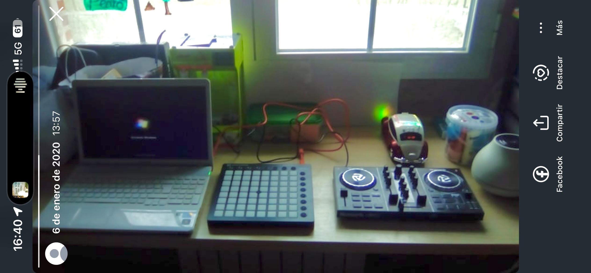
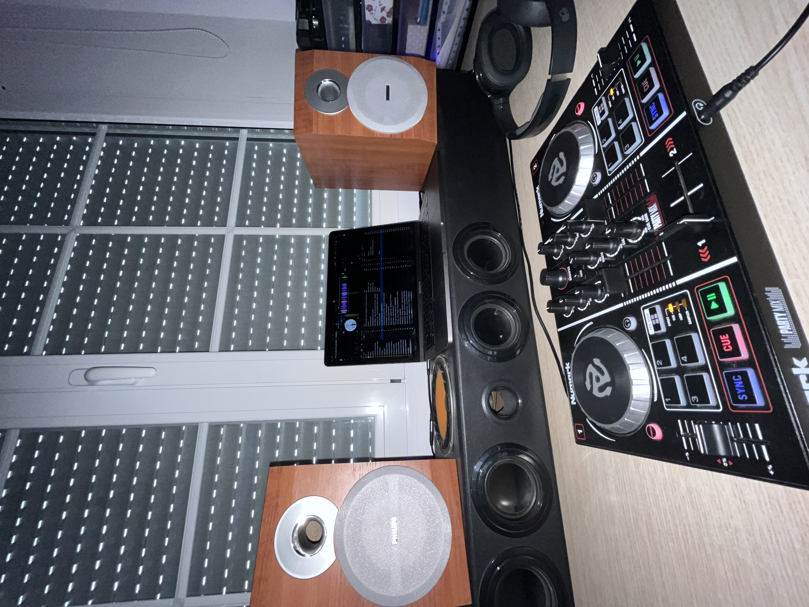
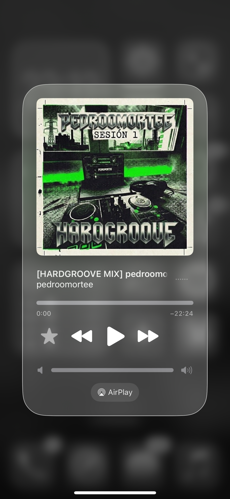
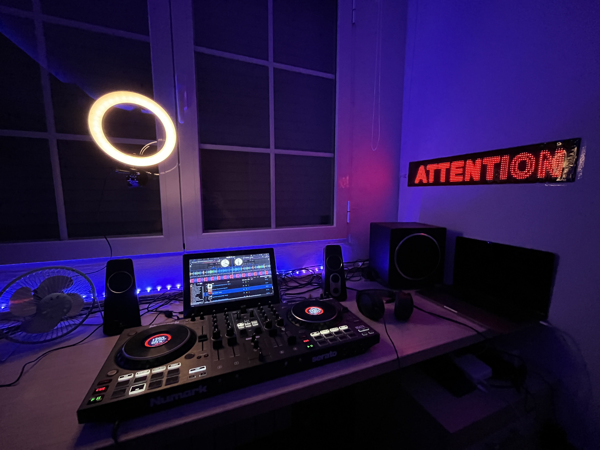
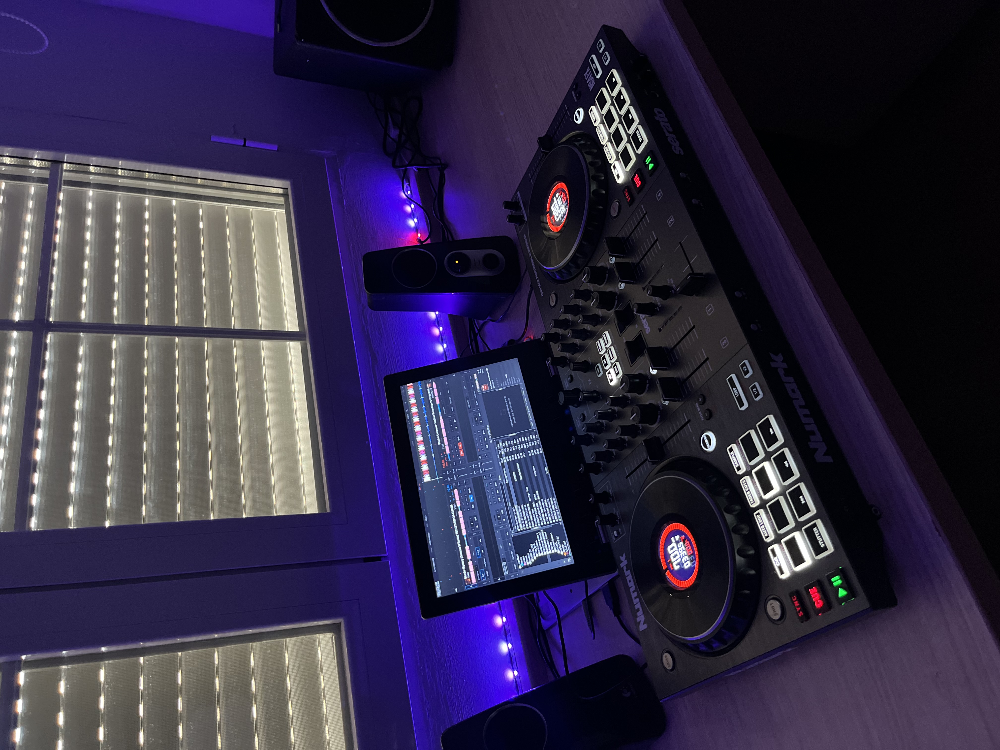

# Proyecto 2: Mezcla y DJ

## Tras los platos: de mi habitación al escenario

La música electrónica siempre ha sido una parte importante de mi vida, pero durante mucho tiempo pinchar fue algo que hacía en casa o rodeado de mis amigos. Este proyecto recoge cómo empezó esa afición, cómo fui encontrando mi sonido y el paso que por fin me atreví a dar: compartir una sesión en público.

## El comienzo: el regalo de Reyes

El 6 de enero de 2020 tenía 10 años y ya sentía mucha curiosidad por el audio. Mis padres me regalaron mi primera controladora, una Numark Party Mix, y aquel regalo hizo que mezclar dejara de ser solo una idea: por fin podía probarlo con mis propias manos.

Por entonces también trasteaba con un Launchpad de Novation y con Ableton Live Lite. Me entretenía produciendo, combinando sonidos y mezclando, sin saber todavía muy bien adónde me llevaría todo eso. Fueron mis primeros pasos y, casi sin darme cuenta, empecé a construir mis primeras bases rítmicas.

## La madurez musical y SoundCloud

### Encontrar mi sonido

Al cumplir 16 años decidí tomarme la mezcla más en serio. Poco a poco me fui decantando por la música electrónica y, en especial, por sonidos como el Hardgroove, el Schranz y el Tech House. Me atraen su energía y sus ritmos, pero también el reto de enlazar los temas y conseguir que una sesión tenga continuidad y personalidad.

Empecé a preparar y grabar mis sesiones con más intención. Bajo el alias PEDROOMORTEE subí a SoundCloud mis primeros sets, entre ellos «Sesión 1» y «Sesión 2». Publicarlos fue una forma de salir un poco de mi habitación: podía compartir lo que estaba haciendo y escuchar la sesión desde otra perspectiva.

El apoyo inicial de mi círculo de amigos significó mucho para mí. Sus mensajes y sus palabras de ánimo me dieron confianza para seguir grabando, mejorar y enseñar algo que hasta entonces había mantenido en un entorno cercano. Para alguien que empezaba, saber que mis amigos escuchaban mis sesiones hizo que todo se sintiera más real.

## Rompiendo la barrera: mi primer bolo público

Aunque llevaba tiempo pinchando en fiestas privadas con mis amigos, por vergüenza no me había atrevido a hacerlo delante de un público más amplio. Me preocupaba equivocarme o no estar a la altura. Esa inseguridad hizo que durante mucho tiempo me quedara en lo conocido, aun teniendo ganas de probar.

El pasado fin de semana di por fin el paso: pinché en público en las prefiestas de mi pueblo, Mojados (Valladolid). Antes de empezar tenía nervios, pero una vez en la cabina me centré en la música y en disfrutar el momento. Todo salió mucho mejor de lo que esperaba.

Recibir tantos halagos después fue una inyección enorme de motivación. No solo me hizo ilusión que la gente disfrutara la sesión; también me confirmó que atreverme había merecido la pena. Sigo teniendo mucho que aprender, pero ya he roto una barrera que antes me parecía difícil de superar.

<figure class="multimedia-articulo">
    <video controls preload="metadata" playsinline>
        <source src="./2/IMG_8115.mp4" type="video/mp4">
        
Tu navegador no puede reproducir este vídeo. <a href="./2/IMG_8115.mp4">Abrir el vídeo de mi primera sesión en público</a>.

    </video>
    <figcaption>Un fragmento de mi primera sesión en público.</figcaption>
</figure>

## Visión de futuro y audiovisual

Ahora quiero aprovechar cualquier oportunidad que tenga para subirme a una cabina y seguir ganando experiencia. Mi primer bolo me ha demostrado que no tengo que esperar a sentirme completamente seguro para dar el siguiente paso: también puedo aprender mientras lo doy.

Además, he empezado a profesionalizar mi proyecto grabando mis sesiones en vídeo con mi nueva cámara, la Panasonic Lumix G7. Me ilusiona unir el mundo del audio con la imagen y cuidar no solo cómo suena cada sesión, sino también cómo la presento y la comparto.

<figure class="multimedia-articulo">
    <video controls preload="metadata" playsinline>
        <source src="./2/VN20260907_052647%203.mp4" type="video/mp4">
        
Tu navegador no puede reproducir este vídeo. <a href="./2/VN20260907_052647%203.mp4">Abrir el vídeo de una de mis sesiones</a>.

    </video>
    <figcaption>Una de mis sesiones grabada en vídeo.</figcaption>
</figure>

Este es solo el comienzo. Quiero seguir explorando la electrónica, mejorar como DJ y convertir cada oportunidad en una experiencia que me acerque un poco más a lo que quiero hacer.
