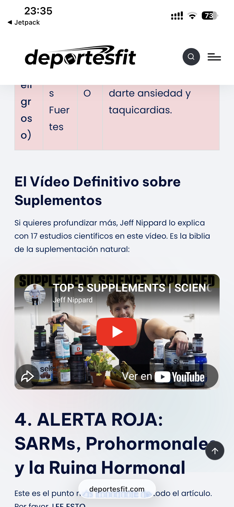
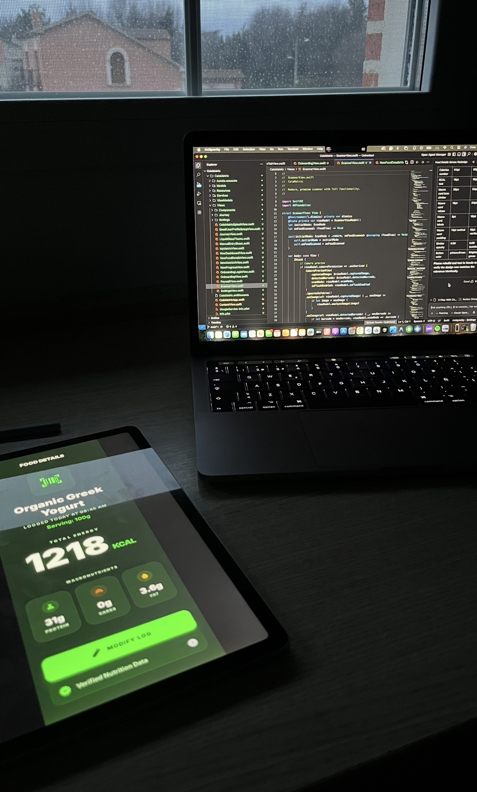
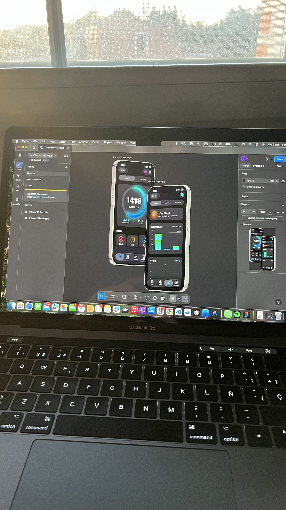
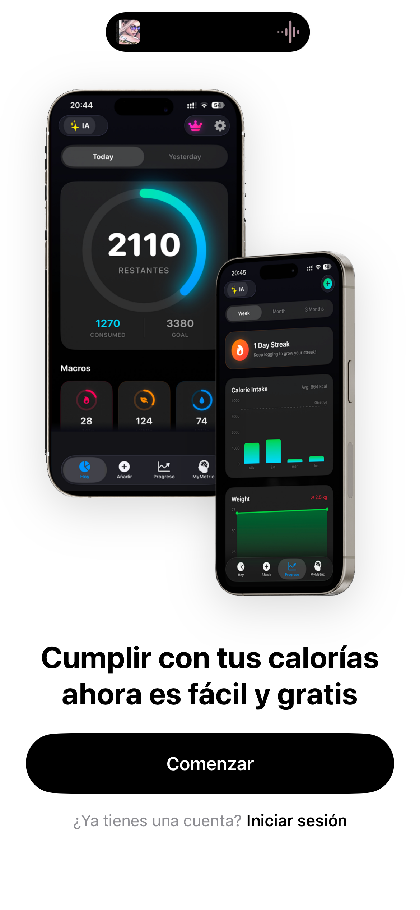
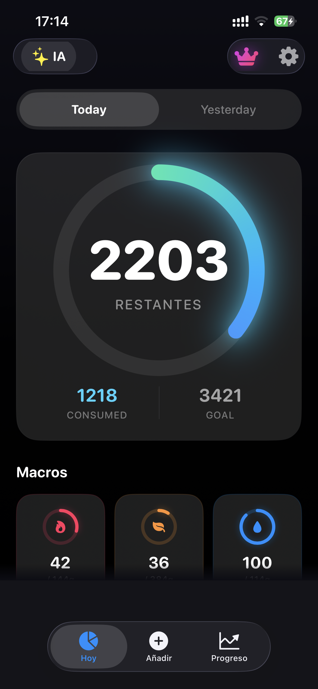
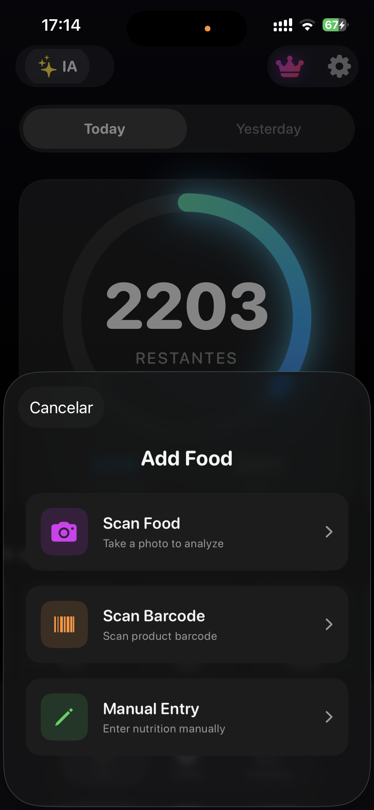
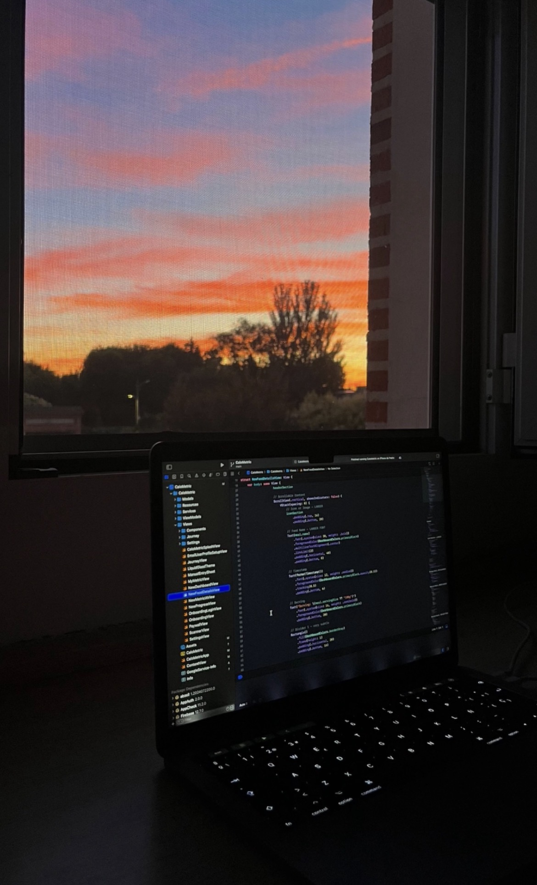

# Proyecto 3: Programación

## Código, tropiezos y aprendizaje: mi trayectoria programando

La programación me ha enseñado que casi nada sale bien a la primera. Muchas veces empiezo con una idea clara y, al ponerme a construirla, aparecen errores, límites que no había previsto y partes que tengo que volver a hacer. Con 17 años sigo aprendiendo por mi cuenta, y cada proyecto —también los que dejé a medias— me ha servido para entender un poco mejor cómo quiero crear.

## Los primeros códigos: Blogger y el parte en clase

### Una web gratuita para empezar a trastear

Mis primeros experimentos fueron con una web de deportes que monté en Blogger. Era una plataforma gratuita de Google, con una dirección bajo su propio subdominio y bastantes límites para personalizarla, pero para mí fue una puerta de entrada: podía escribir HTML, cambiar cosas y descubrir, probando, cómo se construía una web.

### Más visitas, AdSense y un parte

La página empezó a recibir más visitas de las que esperaba. Llegué incluso a monetizarla con AdSense y, en los días buenos, conseguía ganar bastante dinero. Me vine arriba y empecé a dedicarle cada vez más tiempo: tanto, que acabé programando y redactando artículos desde el móvil en clase. Me pillaron y me pusieron un parte. Viéndolo ahora, tiene su punto cómico, aunque en ese momento no me hizo tanta gracia.

Al final lo dejé. Mantener la web y publicar contenido con regularidad exigía muchísimo tiempo para lo que me rentaba. Aun así, fue el proyecto que me hizo pasar de curiosear con una página a preguntarme cómo podía construirla y mejorarla.

## El salto profesional: dominios, hosting y DeportesFit

### De Blogger a mi propio dominio

Tiempo después volví a la idea de una web deportiva, pero esta vez quise hacerlo de forma más seria. Así nació DeportesFit.com: alquilé un dominio y un hosting propios y apliqué todo lo que había ido aprendiendo desde pequeño, tanto en cursos gratuitos de programación como por mi cuenta sobre SEO.

### El muro de YMYL

El sitio quedó mucho más profesional y empezó a recibir tráfico. Pero me encontré con un obstáculo que no había previsto: el contenido relacionado con salud y bienestar entra en las categorías que Google trata como YMYL (*Your Money or Your Life*), donde se exige un nivel especialmente alto de confianza y cuidado. Aunque la web tuviera visitas y estuviera trabajada, AdSense nunca la aprobó. Sin esa vía de ingresos, acabé abandonando el proyecto.

Me frustró invertir tiempo en dejarlo todo bien y no conseguir que saliera adelante. También me quedó claro que programar una web no es solo escribir código: hay decisiones de contenido, confianza, posicionamiento y viabilidad que pueden cambiar por completo el resultado.

## El desarrollo móvil: Swift y CaloMetric

### Aprender Swift construyendo una app

Más adelante quise probar algo distinto: desarrollar para dispositivos Apple. Aprendí Swift y me embarqué en CaloMetric, una aplicación para iOS centrada en el seguimiento de la alimentación. La idea incluía usar inteligencia artificial para analizar fotos de comidas y estimar sus macronutrientes, además de otras herramientas de seguimiento.

### Siete meses de trabajo y una pausa necesaria

Le dediqué más de siete meses. Aprendí muchísimo mientras convertía ideas y diseños en pantallas y funciones, y mientras intentaba que todas las piezas encajaran. Pero el proyecto seguía incompleto y publicar una app también implicaba asumir el coste de la cuenta de desarrollador de Apple, unos 100 dólares. Tuve que tomar una decisión difícil: aparcar CaloMetric en vez de seguir invirtiendo tiempo y dinero sin saber cuándo podría terminarlo.

## Mi visión actual: el código como propósito

### Los proyectos que aparqué también me enseñaron

He empezado proyectos con ilusión y también he tenido que aceptar cuándo era momento de parar. Para mí, dejarlos aparcados no borra lo que aprendí: cada intento me dio experiencia, y cada tropiezo me obligó a buscar otra forma de resolver las cosas o a replantear lo que quería construir.

### Sigo buscando qué construir

Ahora sigo buscando activamente una nueva idea en la que trabajar. No necesito que el próximo proyecto sea perfecto ni que se convierta enseguida en un negocio; quiero encontrar un reto que me motive a aprender, probar y volver a empezar cuando algo no funcione.

La tecnología me interesa de verdad, pero es la programación y el desarrollo de software lo que más me llena. Crear algo desde una idea, ver cómo toma forma y entender cada vez un poco más cómo funciona es lo que le da sentido a todo este camino.
