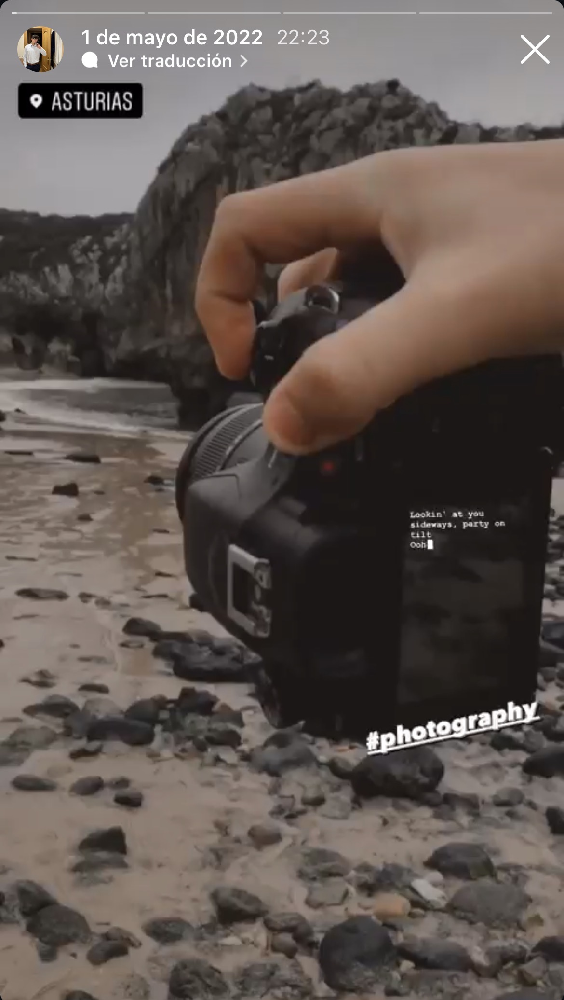

# Proyecto 4: Fotografía y videografía

## A través del objetivo: mi pasión por la fotografía y la videografía

Desde pequeño me han llamado la atención las fotos y los vídeos. Me gusta observar una escena, fijarme en la luz y pensar cómo podría contar ese momento desde otro punto de vista. Con 17 años sigo descubriendo todo lo que se puede hacer con una cámara, pero hay un momento que convirtió esa curiosidad en una afición mucho más seria.

## El despertar visual: mi primera cámara

### La Sony Alpha 58 y mis primeros pasos

En 2022 conseguí mi primera cámara profesional: una Sony Alpha 58. No era un equipo nuevo ni tenía las posibilidades técnicas de las cámaras actuales, y pronto descubrí algunas de sus limitaciones. Aun así, fue la cámara con la que empecé a componer mis primeras fotos y vídeos con más intención, cuidando el encuadre y tratando cada toma como algo más que una simple prueba.

## Volando alto: el mundo de los drones

### Nuevas perspectivas con el SJRC F11S 4K Pro

Con el tiempo me compré un dron, el SJRC F11S 4K Pro, y la afición creció todavía más. Poder elevar la cámara y descubrir el paisaje desde arriba me hizo cogerle muchísimo más cariño y entusiasmo al mundo audiovisual. Empecé a grabar planos aéreos y a compartirlos en Instagram con mis amigos; ver un lugar conocido desde otra perspectiva siempre tenía algo especial.

<figure class="multimedia-articulo">
    <video controls preload="metadata" playsinline>
        <source src="./4/ScreenRecording_09-30-2026%2018-54-05_1.mp4" type="video/mp4">
        
Tu navegador no puede reproducir este vídeo. <a href="./4/ScreenRecording_09-30-2026%2018-54-05_1.mp4">Abrir el vídeo</a>.

    </video>
    <figcaption>Un fragmento de vídeo de mi archivo audiovisual.</figcaption>
</figure>

## El proyecto de TIC: edición y trabajo en equipo

### Crear un vídeo junto a Alberto

El curso pasado, un trabajo de TIC me hizo reconectar de lleno con este hobby. Lo hice junto a mi compañero Alberto y requirió bastante esfuerzo, tanto durante la producción como en la edición. Trabajar con herramientas profesionales como DaVinci Resolve o Premiere Pro me permitió cuidar el resultado, revisar cada plano y entender todo lo que ocurre entre grabar una idea y convertirla en un vídeo terminado.
<iframe width="560" height="315" src="https://www.youtube.com/embed/NYuFq7Ykyyk?si=0LugNjIGGF2bw6ea" title="YouTube video player" frameborder="0" allow="accelerometer; autoplay; clipboard-write; encrypted-media; gyroscope; picture-in-picture; web-share" referrerpolicy="strict-origin-when-cross-origin" allowfullscreen></iframe>

<figure class="multimedia-articulo">
    <video controls preload="metadata" playsinline>
        <source src="./4/ScreenRecording_09-30-2026%2018-55-31_1.mp4" type="video/mp4">
        
Tu navegador no puede reproducir este vídeo. <a href="./4/ScreenRecording_09-30-2026%2018-55-31_1.mp4">Abrir el vídeo</a>.

    </video>
    <figcaption>Otro fragmento de vídeo de esta etapa.</figcaption>
</figure>

## El presente y la Lumix G7

### Una nueva cámara y muchas ideas por grabar

Hace poco di un salto de calidad y me compré una Panasonic Lumix G7. Con ella estoy retomando esta afición con más fuerza que nunca: tengo ganas de seguir haciendo fotos, grabar nuevos vídeos y aprender a sacar más partido a cada plano.

<figure class="multimedia-articulo">
    <video controls preload="metadata" playsinline>
        <source src="./4/VN20260930_184010.mp4" type="video/mp4">
        
Tu navegador no puede reproducir este vídeo. <a href="./4/VN20260930_184010.mp4">Abrir el vídeo</a>.

    </video>
    <figcaption>Un vídeo reciente de mi archivo audiovisual.</figcaption>
</figure>

También tengo una cantidad prácticamente infinita de vídeos y fotos guardados. Si me pusiera a subirlos todos al portafolio, tendría que hacer 10 webs distintas para que cupiesen todos.
